exclude: true


```{r, include = F}
# install.packages("pacman")
library(pacman)
p_load(
  kableExtra, snakecase, janitor, huxtable, pagedown, # Formating 
  ggplot2, ggthemes, ggeffects, ggridges, igraph, network, ggpubr, ggformula, gridExtra, RColorBrewer, # Visualization
  tidyverse, lubridate, stringr, dplyr, purrr, tibble, tidyr, lubridate, knitr, # General tidyverse toolkit 
  readxl,reshape2, 
  parallel, future, furrr, future.apply, doParallel, # Paralleling
  emIRT, MCMCpack, wnominate, pscl, rgenoud, basicspace,  # for scaling   
  devtools, reticulate, usethis # programming
)


p_load_gh("kosukeimai/emIRT", # for scaling from Github
          "tzuliu/ooc",
          "cran/oc",
          "uniofessex/asmcjr",
          "wmay/dwnominate", dependencies = TRUE)


# Define colors
red_pink   = "#e64173"
turquoise  = "#20B2AA"
orange     = "#FFA500"
red        = "#fb6107"
blue       = "#3b3b9a"
green      = "#8bb174"
grey_light = "grey70"
grey_mid   = "grey50"
grey_dark  = "grey20"
purple     = "#6A5ACD"
brown      = "#9b684d"
black      = "#000000"
# Tetradic Color
magenta_red = "#9b4d80"
magenta_green = "#4d9b68"
red_green = "#9b4d59"
blue_green = "#4d599b"
magenta_yellow = "#9b8f4d"


# Knitr options
opts_chunk$set(
  comment = "#>",
  fig.align = "center",
  fig.height = 7,
  fig.width = 10.5,
  warning = F,
  message = F
)
opts_chunk$set(dev = "svg")
options(device = function(file, width, height) {
  svg(tempfile(), width = width, height = height)
})
options(knitr.table.format = "html")

# pagedown::chrome_print("file:///Users/yenchiehliao/Dropbox/redgaurds/slides/slides.html#1", verbose = FALSE)
```

---
layout: true
# Research Questions
---
name:research_questions

&nbsp;

-  The main question of our interest is the overall .hi-slate[ideological dissimilarity] between <u>the political elite</u> and <u>the Red Guards</u>: if overall, the political elite placed themselves differently vis-à-vis the Red Guards along the spectrum of ideological positions. 

--

- Secondly, we study, at .hi-slate[the time interval of each major incident], the degree of disagreement among different factions in the Red Guards and investigate its spatial positioning in correspond to the political elite.

---
layout: true
# Puzzles
---

&nbsp;

- The literature has well explained how activists of the mass movement (the Red Guards) .hi-slate[were divided into multiple factions] that fought for controls for ruling power, political resources and other interests, such as educational institutes, workplaces, and local governments, etc. (e.g.Walder and Su 2003; Walder 2009).


--

- However, how different factions among the Red Guards .hi-slate[selected positions of their own, or stances towards allies and against rivalries, or attitudes towards the political elite], during the mass movement remains relatively untouched.

---
layout: true
# Backgroud
---
name:background

### Historical Backgroud

- The mass movement initiated by commoners during the Cultural Revolution set off as a comprehensive attack on the system of bureaucracy, where the major political power was firmly grasped by the elite. 

--

- For a period, Mao Zedong (毛澤東) and his central leadership were .hi-slate[dis-supportive] to plans that involved forming associations and groups independent from the Party and condemned any unauthorized action by the mass to remove politicians from their office.

--

- However, later on, Mao's attitude became so shifted that he .hi-slate[openly endorsed] and authorized the mass movement and .hi-slate[even encouraged students into participation], without legal or political restriction imposed.

---

### The Origin of Red Guards

- First of all, .hi-slate[aims and scopes of “the Red Guards”], for Mao and the Central Cultural Revolution Group (CCRG), could be shaped accordingly to fulfill their needs along with the evolvement of the movement.

--

- Narrowly speaking, the Red Guards refer to active high school student groups that were based in different provinces in China .hi-slate[from May to late 1966]. Particularly, the Red Guards from colleges and were active at the late stage of the movement is labelled as “the Rebels”.

--

- Widely speaking, the Red Guards include all active from high school to college student groups, as well as a proportion of newly joined high school students after September 1966. .hi-slate[The widely-defined Red Guards population matches participating student groups at various stages of the Cultural Revolution].

---
layout: true
# Data
---
name:data


### The Source
- This paper draws on the archive from Chinese Cultural Revolution Database (1966-1976) managed by the Chinese University of Hong Kong under the database named Databases for .hi-slate[the History of Contemporary Chinese Political Movements]. 
### 
```{r echo = F, out.width = "52%"}

```

--

### Selected Documents
- Representative textual data include .hi-slate[tabloids (Xiaobao 小报)], .hi-slate[big-character posters (Dazibao 大字报)] and .hi-slate[party-related office documents]. 

---

### Big-character Posters (Dazibao 大字报)
```{r echo = F, out.width = "80%"}
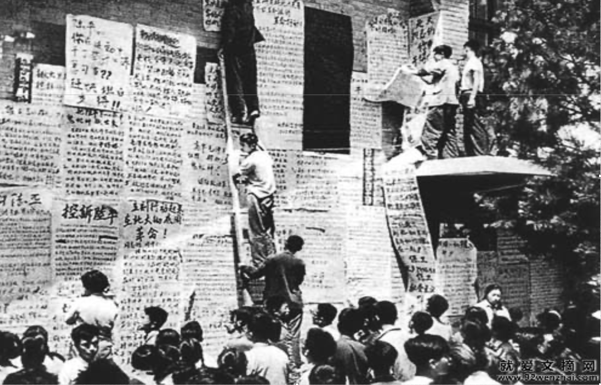
```


---

### Tabloids (Xiaobao 小报)
```{r echo = F, out.width = "70%"}
knitr::include_graphics("./images/xiabao.png")
```

---

### Documents from the Central Officials
```{r echo = F, out.width = "45%"}
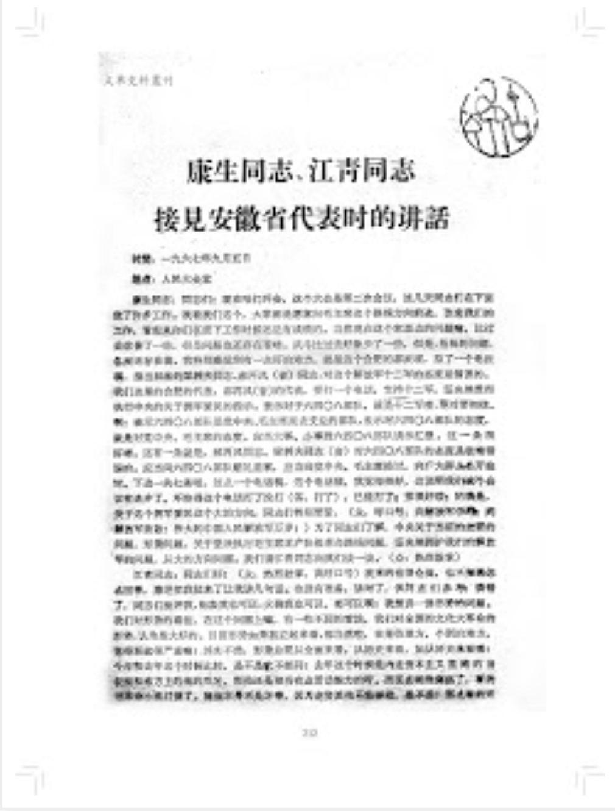
```


---
&nbsp;

### The Document Types:
```{r echo = F, out.width = "100%"}
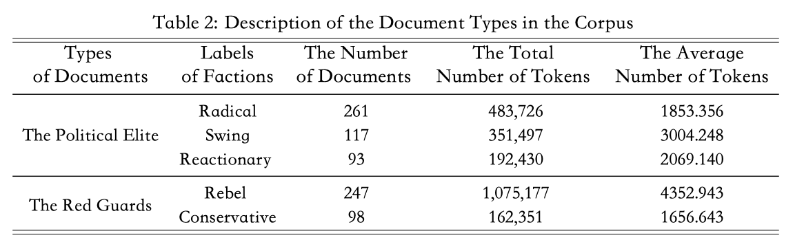
```

---
layout: true
# Estimation Strategy
---
&nbsp;

### The Rationale of the Methodolgy

-  We seek to find an algorithm that serves two main functions: i) .hi-slate[extract key Chinese words and phrases (slogans)]; ii) .hi-slate[estimate the differences of spatial positions] using the extracted textual data. 

--

- To this end, we develop a new strain of .hi-slate[Wordfish algorithm] that takes advantage of the facilitation of TextRank algorithm to extract Chinese characters and phrases.

---
layout: true
# Keyword Extraction 
---

### NLP Toolkit: UDpipe 

- UDPipe is capable of performing excellent parts of speech tagging such as .hi-slate[Universal POS tags] and .hi-slate[XPOS], .hi-slate[morphological features], and .hi-slate[syntactic dependencies], and syntactic analysis of CoNLL-U input based on .hi-slate[Universal Dependencies (UD) framework].

```{r echo = F, out.width = "70%"}

```

---

### UDpipe 2.5 Language Model
- we apply a pre-trained model from UDpipe, with .hi-slate[parts of speech (POS) tagging] and .hi-slate[linguistic dependencies], to tokenize the collected textual data(Straka, Hajič, and Straková 2016; Straka and Straková 2017), see https://ufal.mff.cuni.cz/udpipe/2.

```{r echo = F, out.width = "60%"}
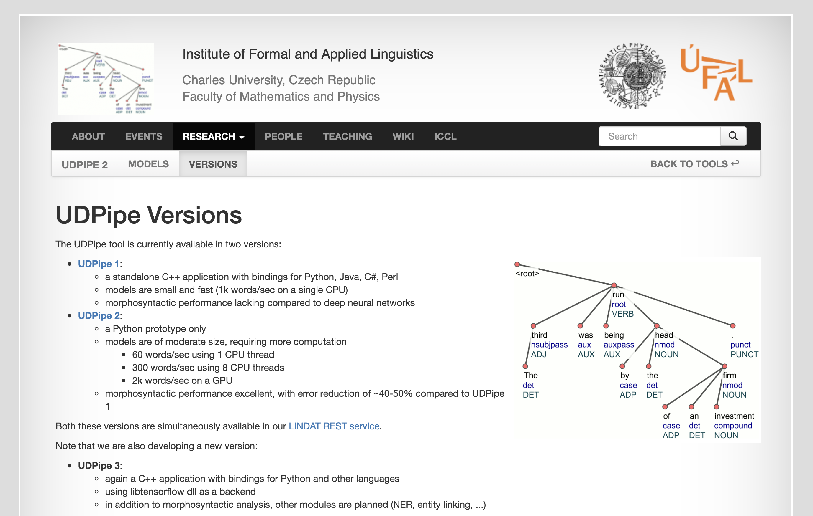
```

---

### UD Chinese-GSDSimp Model

- The pre-trained model for NLP task is .hi-slate[UD Chinese-GSDSimp] (trained and contributed by Qi and Yasuoka 2020) and can be found at the authors' Github repository, at https://github.com/yl17124/UD_Chinese-GSDSimp. 

- Human encoding: manually  augment a set of corpus following  the structure of CONLL-U format by adding related documents. 
```{r echo = F, out.width = "50%"}
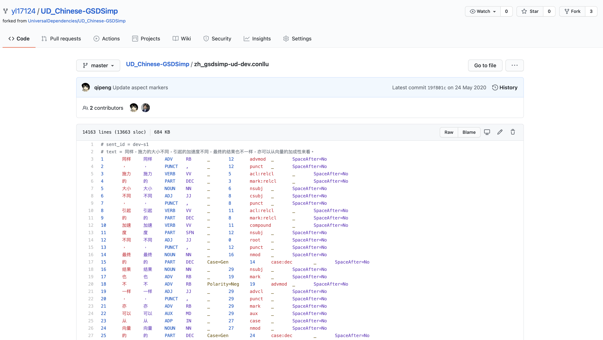
```


---

### The Concept of TextRank

- The first stage applies the TextRank algorithm that is commonly used in .hi-slate[automated keywords extraction techniques] of Natural Language Processing (NLP) to create a subset of words and phrases that represents the most important or relevant information by calculating the weight for each token within the document.

--

- In particular, .hi-slate[the tagging of linguistic features] can be utilized to extract important phrases and pair n-grams as noun phrases via keyword extraction techniques. 

---

&nbsp;


- TextRank is .hi-slate[an unsupervised graph-based algorithm] for automated summarization of text containing keywords and initially introduced by Mihalcea and Tarau (2004) by converting Google's PageRank algorithms (Brin and Page 1998) into feature selection to extract certain phrases. 

--

- The ultimate goal of a keyword extraction is to effectively select a set of .hi-slate[representative terms] from the text that best describe and summarize the original document. 

--

- Therefore, these representative terms are the near-minimum information set that can be utilized for text classification, document collection and information summarization, from which .hi-slate[domain-specific dictionaries]are constructed. 

---

### The Flow of the TextRank

```{r echo = F, out.width = "70%"}
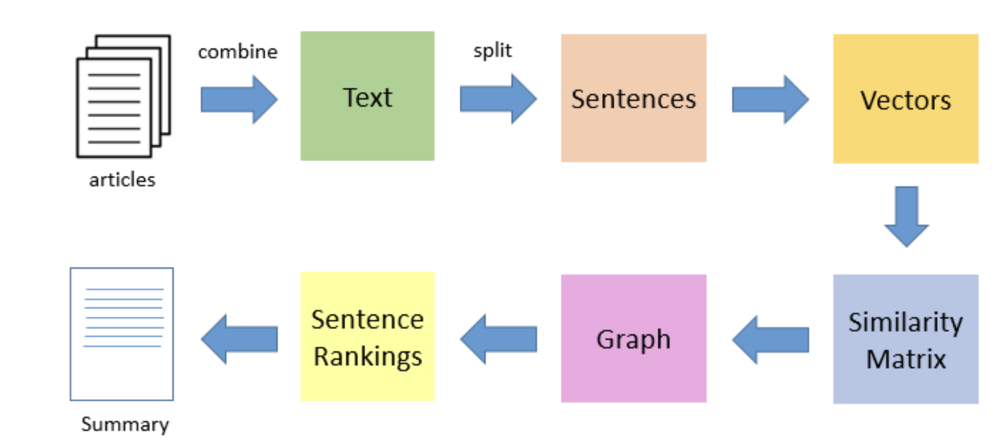
```


---

### The Rationale and Concept

- TextRank reads original text as input and .hi-slate[ranks a sequence of single or multiple lexical units] extracted from the input, and these are hi-slate[stored as vertices] in the text graph. 

```{r echo = F, out.width = "35%"}
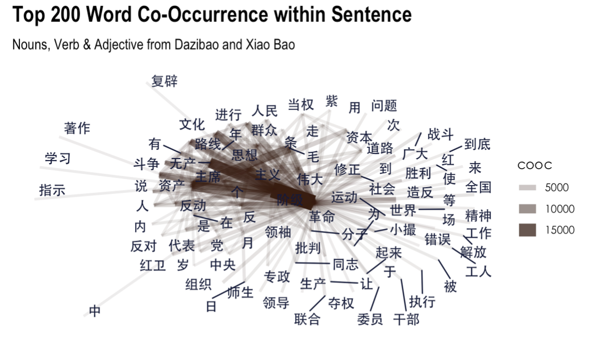
```

--

- We particularly define the property of .hi-slate[co-occurrence] as such relation between two .hi-slate[vertices]: a pair of lexical units are regarded as potentially linked .hi-slate[if they co-occur within a window of maximum n-grams (n is set to be 5 in our study)], and their representative vertices are linked in the text graph. 

---

#### Top 15 Keywords Identified by TextRank at Each Major Incident
```{r echo = F, out.width = "55%"}
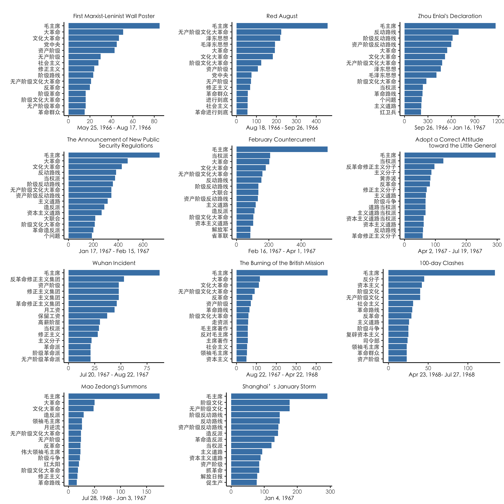
```

---
layout: true
# Wordfish Scaling Model
---

### The Concept of Wordfish

- In the second stage, the algorithm estimates positions of each faction based on the .hi-slate[Poisson scaling model] proposed by Slapin and Proksch (2008). 

--

- The model produces the estimated positions by .hi-slate[analyzing frequencies of extracted keywords and phrases] from dictionaries constructed in the first stage. 
--

- The model takes the following functional form:

$$y_{jm}\sim	Poisson(\theta_{jm}) \theta_{jm}=	exp(a_{m}+b_{j}+\beta_{j}*w_{i}^{m}),$$
---
layout: true
# Analytical Findings
---
&nbsp;

### Figure 2: Smoothed Density Distribution of Estimated Positions for the Political Elite and the Red Gaurds

```{r echo = F, out.width = "100%"}
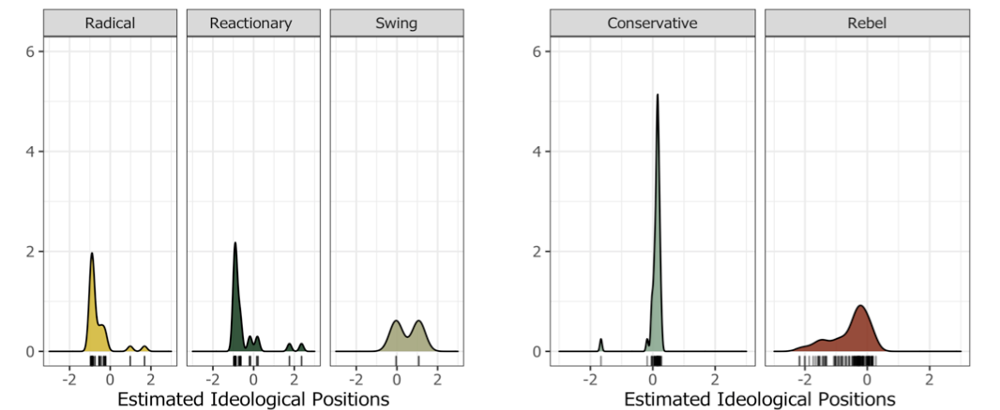
```


---
&nbsp;

### Figure 3: Estimated Positions for Invidiual Member and Organizations in the Red Gaurds

```{r echo = F, out.width = "50%"}
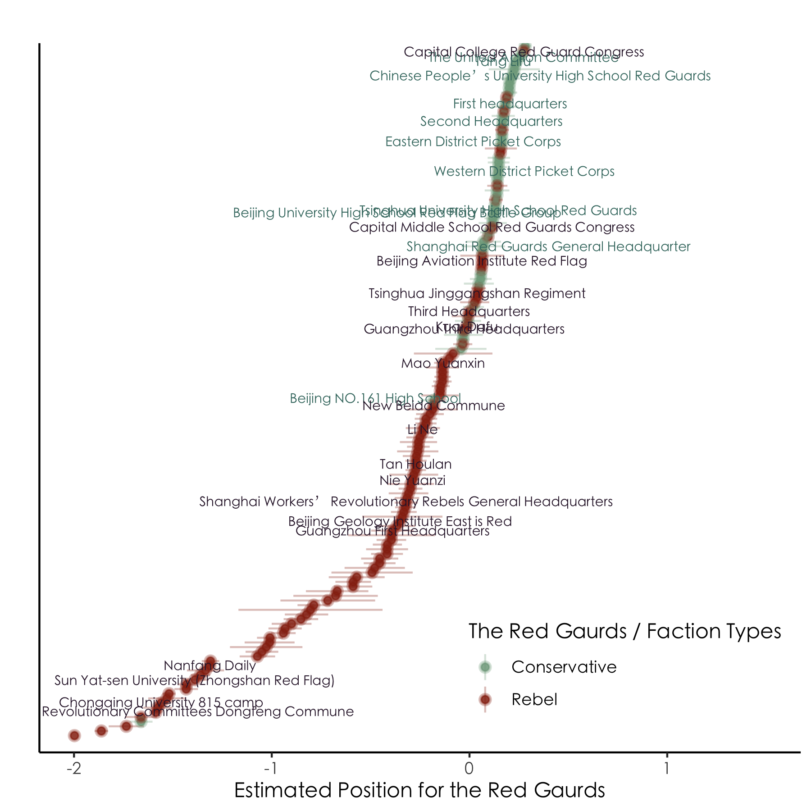
```

---
&nbsp;
### Competing Claims

- One explanation for these divisions classifies factions based on their orientation toward .hi-slate[the sociopolitical status quo] or from different social background (Chan 1982; Chan, Rosen, and Unger 1980; Lee 1978; Rosen 1982; Unger 1982).

--

- Another explanation points the underlying conflicts and disputes evolving rapidly over time between factions, was emerged when the Red Guards in similar positions made conflicting choices in .hi-slate[ambiguous contexts] in the status quo (Walder 2006, 712-713)


---
&nbsp;

### Figure 4: Estimated Positions for Zhou Enlai's Declation:
```{r echo = F, out.width = "50%"}
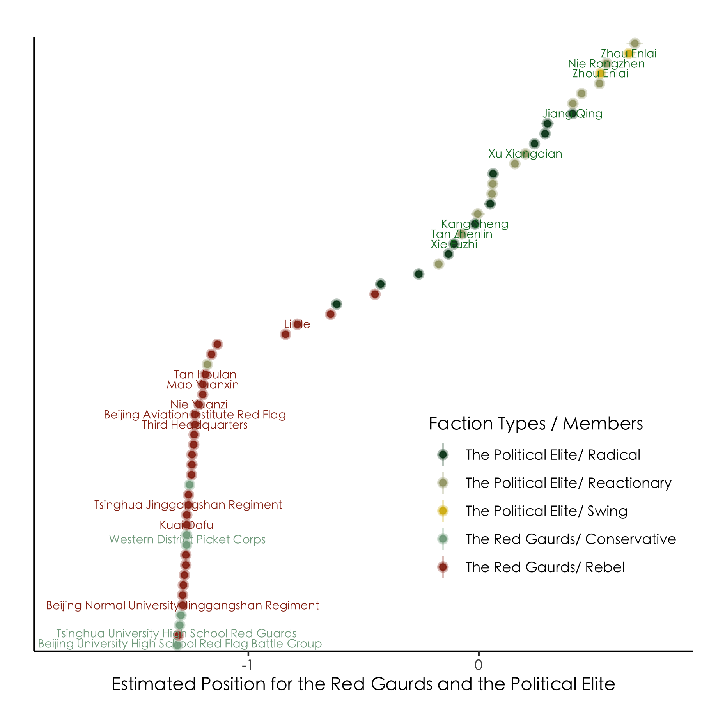
```

---
&nbsp;

### Figure 5: Estimated Positions for the Announcement of New Public Security Regulations:

```{r echo = F, out.width = "50%"}
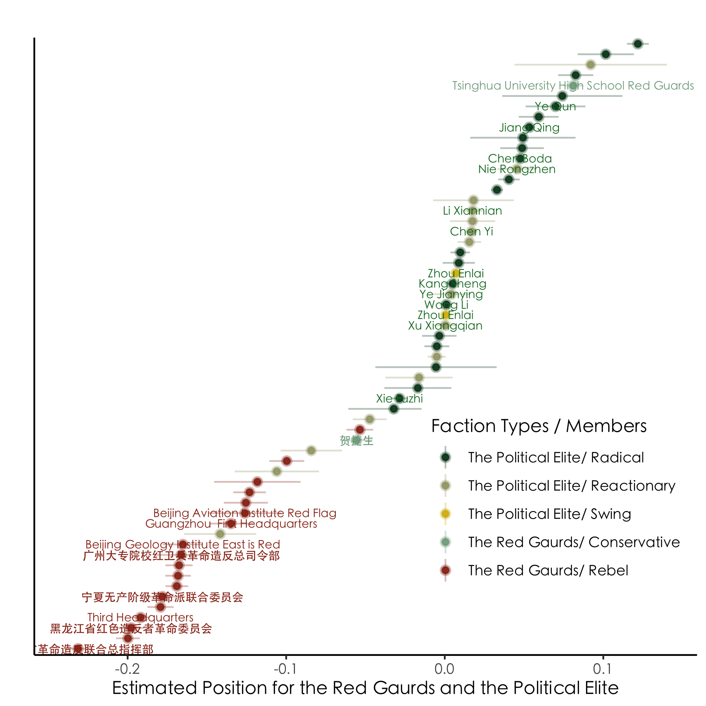
```

---
&nbsp;
### Figure 6: Estimated Positions for February Countercurrent:
```{r echo = F, out.width = "50%"}
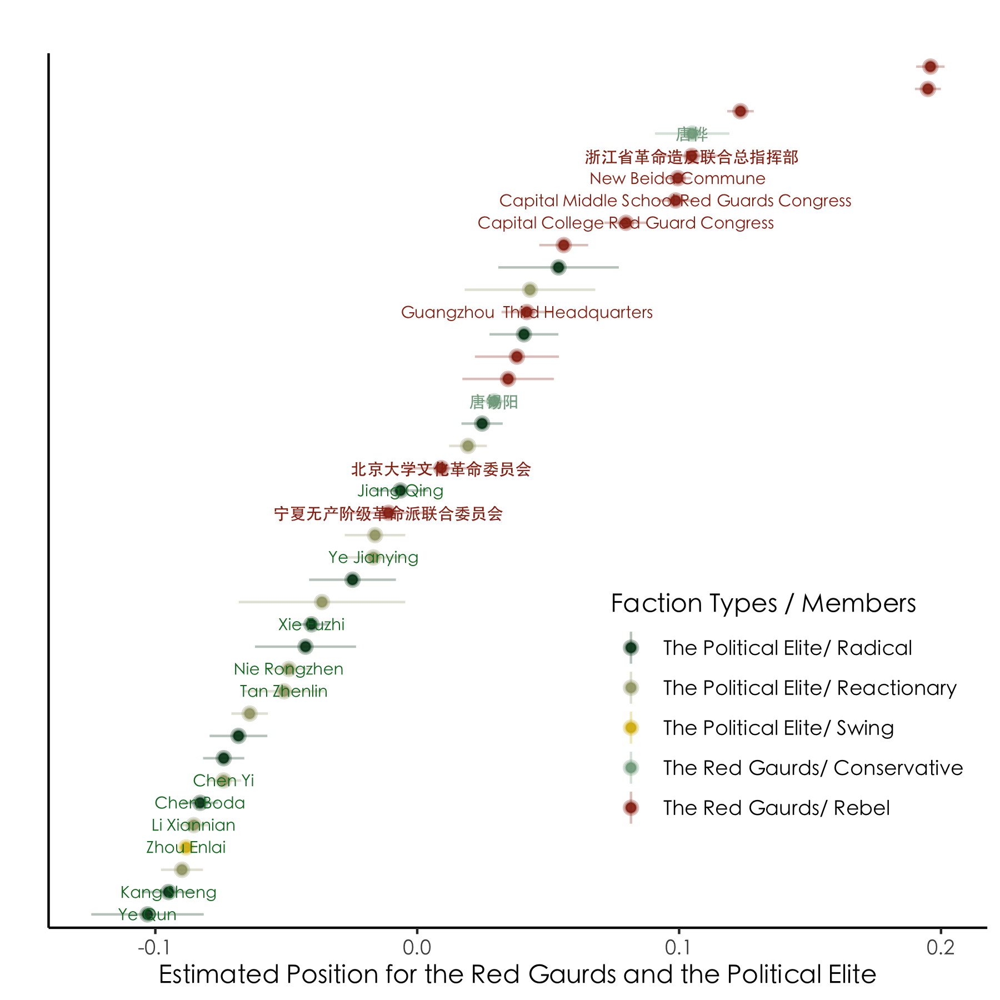
```


---
layout: true
# Takeways
---

&nbsp;

### Conclusion

- Estimation outcomes of ideological positions demonstrate that the majority of the Red Guards factions and the elite factions are .hi-slate[contrasting groups for most of time]. 

--

- This seems sensible and matches many evidences from previous literature (Walder and Su 2003; Wang 2019; Su 2006; Walder and Lu 2017; Walder 2016). However, .hi-slate[the position of these individual factions dynamically varied according to the development of incidents] and the shift of the political atmosphere. 

---

&nbsp;

### Contribution

- First, we augment TextRank so that we only care about .hi-slate[keywords and phrase] in each document and noisy terms have been filtered out before ideological position estimation. This is likely to .hi-slate[mitigate estimation error] due to less presence of the noise. 

--

- Second, different from many languages, Chinese speeches are .hi-slate[frequently phrase-based], rather than single word- (character-) based.

--

- TextRank is a graph-based algorithm that serves our purpose to interpret Chinese by extracting key phrases from texts. 

---
layout: false
class: inverse, center, middle

# Thank You
